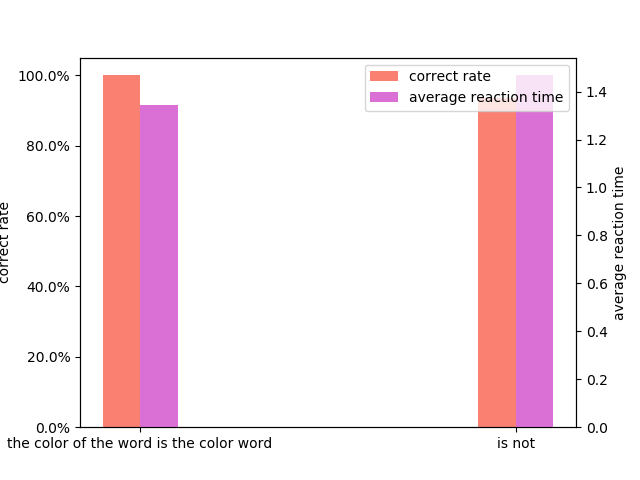

### Stroop

#### program

1. click `START` button to start testing
2. click `STOP & SAVE` button to stop testing and save test data to excel
3. click `STATISTICS` button to show statistical diagram

#### statistics

